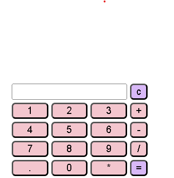

# Calculator Project

A simple calculator made using **HTML**, **CSS**, and **JavaScript**.

## Features
- Perform addition, subtraction, multiplication, and division
- Clean, simple user interface
- Responsive design

## How to Use
1. Open `index.html` in your browser
2. Use the calculator buttons to perform calculations

## Author
**Raksha Shetty** – BCA Student - Agnirva Software Internship
